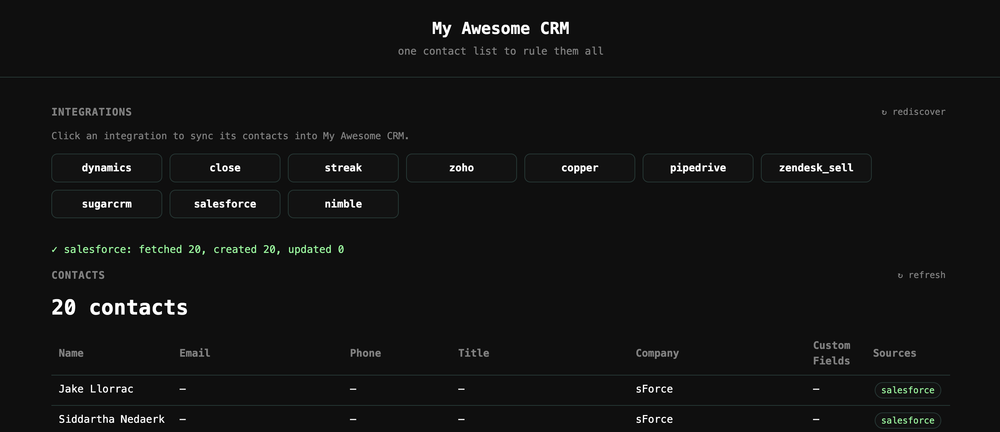

<p align="center">
  
</p>


# My Awesome CRM

> One store to hold them all. Ten CRMs walk into a bar, one tidy little database walks out.

You've got contacts in Salesforce. And Dynamics. And that one in Pipedrive your coworker swore by. **My Awesome CRM** vacuums people out of a fleet of CRM providers and parks them in one simple, generic store behind a tidy little API — so everything lives in one place you can actually query.

---

## ✨ What it does

- 🔌 **Plug-and-play integrations** — drop a provider folder in, and it gets auto-discovered. No registry, no config, no ceremony.
- 🗃️ **Generic, type-agnostic storage** — every row is just a `data_type` (e.g. `"contact"`), the `source` that produced it, and a free-form JSON `data` payload. The store doesn't care what shape your records are.
- ↩️ **Idempotent re-syncs** — the host upserts on `(source, data_type, external_id)`: known records are updated in place, new ones are inserted, and nothing is ever deleted. Syncing unchanged data twice is a no-op.
- 👀 **Read-back callback** — when an integration runs, the host hands it a callback to read everything already stored for a `data_type`, so the integration can do whatever it likes with the existing data.
- 🖥️ **Built-in web UI** — open the root URL and click your way through discovery, ingestion, and the record list. No auth, no setup.
- 📋 **Paginated records API** — browse everything, or filter to a single `data_type`.

> **Heads up:** the host matches records by their provider-side `external_id` (scoped to the integration and `data_type`). Records are stored verbatim — there's no fuzzy merging or cross-provider deduplication. A record with no `external_id` can't be matched, so it's always inserted.

## 🏢 Supported CRMs (10 and counting)

| | | |
|---|---|---|
| Salesforce | Dynamics365 | Pipedrive |
| Zoho | Copper | Close |
| Streak | Zendesk Sell | SugarCRM |
| Nimble | | |

Each one lives in `src/integrations/<provider>/` and just has to promise two things:

```python
DATA_TYPE = "contact"            # what kind of record this integration produces

def fetch(get_stored):           # the host calls this to run the integration
    existing = get_stored("contact")   # read every stored row of this data_type
    ...                                # talk to the provider, do your thing
    return [ {...}, {...} ]             # the data payloads to store (verbatim)
```

Honor that contract and the host picks you up automatically. 🎉

### 🪄 Integrations are built with \*\*\*plain

You don't hand-write the integration code — you write a **[\*\*\*plain](https://plainlang.org)** spec and let the renderer generate it. Each provider is a `.plain` module under `plain/` (e.g. `plain/salesforce.plain`) that describes *what* the integration does; the generated plug-in lands in `src/integrations/<provider>/`. The `.plain` specs are the source of truth — the code under `src/integrations/` is a read-only artifact, so you change behavior by editing the spec and re-rendering, never by editing the generated files.

### ▶️ Rendering a spec

You render from the `plain/` folder: `codeplain` reads a module (e.g. `hubspot.plain`) and (re)generates its plug-in under `src/integrations/<provider>/`. Editing the spec and re-rendering is the *only* supported way to change an integration — never touch the generated files.

Prerequisites: the `codeplain` CLI on your `PATH` and a `CODEPLAIN_API_KEY` exported in your environment.

**macOS / Linux (the default).** The checked-in `config.yaml` wires up the Bash test-runner scripts (`test_scripts/*.sh`), so there's nothing extra to pass:

```bash
cd plain
codeplain hubspot.plain
```

> Add `--dry-run` to preview a render without generating any code.

**Windows.** Run it from **PowerShell** and point `codeplain` at the Windows config, `config.pwsh.yaml`, which wires up the PowerShell test-runner scripts (`test_scripts/*.ps1`) in place of the Bash ones:

```powershell
cd plain
codeplain hubspot.plain --config-name config.pwsh.yaml
```

### 🎓 Want to add your own integration?

This repo doubles as a hands-on **workshop**. Follow **[docs/EXERCISE.md](docs/EXERCISE.md)** to use *integration-forge* (the agent skill pack) to build a HubSpot contacts integration from prompts, then extend it to sync accounts.

## 🧰 Built with

- ⚡ **FastAPI** — the web framework
- 🐘 **SQLModel** + **SQLite** — model & storage
- 🪵 **JSON logging** — for the observability nerds (we see you, and we love you)

---

## 🚀 Quickstart

### The easy way — one script does it all 🪄

There's a getting-started script that bootstraps **and** runs everything. It's
idempotent: the first run sets up Python (3.12 or newer), the virtualenv, and
the dependencies, then starts the server — and every run after that just starts
the server.

```bash
# macOS / Linux
./scripts/start.sh
```

```powershell
# Windows (PowerShell)
.\scripts\start.ps1
```

What the script does, in order:

1. **Checks for Python 3.12 or newer.** If none is found, it asks before
   installing Python 3.12 for you — via Homebrew on macOS, `apt`/`dnf` on Linux,
   or winget/Chocolatey on Windows.
2. **Creates `.venv`** if it isn't there yet.
3. **Installs `requirements.txt`** — only when they're missing or have changed.
4. **Starts the server** on `CRM_PORT` (default `8000`).

> On Windows you may need to allow the script to run once:
> `powershell -ExecutionPolicy Bypass -File .\scripts\start.ps1`

### The manual way (with Python 3.12+ already installed) 🔧 

Prefer to drive it yourself? The same steps by hand:

```bash
# 1. Set up the environment
python -m venv .venv && source .venv/bin/activate
pip install -r requirements.txt

# 2. Liftoff 🛫
uvicorn src.main:app --reload
```

Now visit:

- **http://localhost:8000/** — the built-in web UI (discover → ingest → browse records)
- **http://localhost:8000/docs** — the interactive Swagger playground

The server itself is **unauthenticated** — there's no `X-API-Key`. The only credentials in play are the per-provider ones each integration reads from the environment when it runs.

### ⚙️ Configuration

All optional:

| Variable | Default | What it does |
|---|---|---|
| `CRM_PORT` | `8000` | Port to serve on. |
| `CRM_DB_PATH` | `crm.db` | Where the SQLite file lives. |

Provider integrations read their own credentials from the environment (e.g. `SALESFORCE_CLIENT_ID`, `SALESFORCE_CLIENT_SECRET` for Salesforce).

---

## 🎮 Taking it for a spin

The easiest way is the **web UI at http://localhost:8000/** — it discovers the
integrations, ingests them on a click, and shows the stored records. Or, from the terminal:

```bash
# See which integrations the host discovered
curl -X POST localhost:8000/ingest/discover

# Pull everyone in from Salesforce
curl localhost:8000/ingest/salesforce
# → {"integration":"salesforce","data_types":{"contact":42},"fetched":42,"stored":42,"replaced":0,"unchanged":0}
# Run it again with unchanged data and it's a no-op:
# → {"integration":"salesforce","data_types":{"contact":42},"fetched":42,"stored":0,"replaced":0,"unchanged":42}

# Browse everything in the store
curl "localhost:8000/records?limit=10"

# Or just one data_type
curl "localhost:8000/records?data_type=contact&limit=10"
```

## 🗺️ The grand tour

```
src/
├── main.py              # 🚪 FastAPI app + startup ritual + web UI route
├── config.py            # ⚙️  Lazy-loaded settings
├── db.py                # 🐘 Engine & sessions
├── static/              # 🖥️  The single-page web UI (index.html)
├── api/                 # 🛣️  Routes: health, records, ingest
├── services/
│   └── ingest.py        # 🔍 Discovery + orchestration (run integration → store rows)
├── models/              # 📦 The generic Record table + API schemas
├── repositories/        # 🗄️  Data access (record_repo)
└── integrations/        # 🔌 One folder per CRM provider
```

## 🧪 Tests

There's a test for basically everything — APIs, services, repositories, and every single integration's client + mapping.

```bash
pytest
```

---

## 🗃️ How storage works

There's exactly one table, and it's deliberately dumb:

| Column | What it holds |
|---|---|
| `id` | Primary key. |
| `data_type` | The kind of record, e.g. `"contact"`. |
| `source` | Which integration produced the row. |
| `data` | The record itself, as free-form JSON. |
| `created_at` / `updated_at` | Timestamps. |

When you run an integration:

1. The host calls its `fetch(get_stored)`, handing over a callback to read everything already stored for a `data_type`.
2. The integration returns a list of `data` payloads.
3. The host **upserts** each one, matching on `(source, data_type, external_id)`:
   - a record that matches an existing row **updates it in place** (only when the data actually changed — counted as `replaced`),
   - a record with no match is **inserted** (counted as `stored`),
   - an existing record that's identical is **left untouched** (counted as `unchanged`),
   - and **nothing is ever deleted**.

So re-running an integration is safe and cheap: unchanged records produce no writes, changed records are updated, and new records are added — the store only ever grows or updates, never loses data. 🕊️

---

<sub>Made with FastAPI, a generic JSON column, and a little bit of ✨.</sub>
